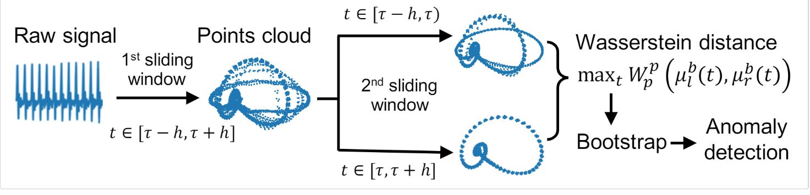

# Unsupervised-heart-beat-anomalies-detection

This Repositiry consist from 2 main part, Heart beat anomalies detection(Arrhythmia) and blood pressure estimation

# 1) Heart Beat Anomalies Detection
## Bootstrap Algorithm
We propose    a    new    unsupervised    and    non-parametric  method  to  detect  change  points  in electrocardiography.  The detection relies on  optimal  transport  theory  combined  with  topological analysis and the bootstrap procedure.  The algorithm is designed to detect changes in virtually any harmonic or a partially harmonic signal and is verified on ECG data streams.  We successfully find abnormal or irregular cardiac cycles in the waveforms for the six of the most frequent types of clinical arrhythmias using a single algorithm. Our unsupervised approach reaches the level of performance of the supervised state-of-the-art techniques.  We provide conceptual justification for  the efficiency of the method.

## Requirements:
biosppy

heartpy

POT(conda install -c conda-forge pot)

## Usage
Example of usage describes in Example Bootstrap Algorithm.ipynb. As a result we have points which corresponds to Wasserstein distances inside each point cloud. Each point has corresponded indexes, then it is possible to find are with arrhythmia in original time series.

